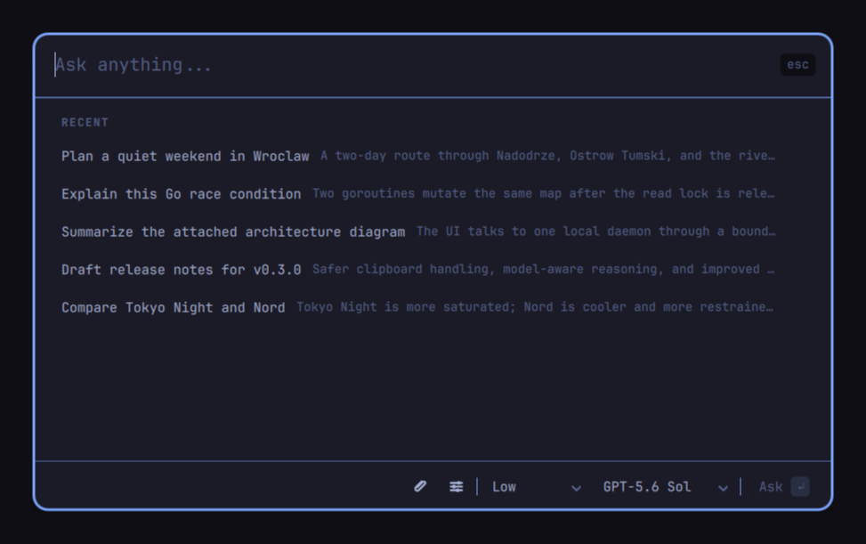
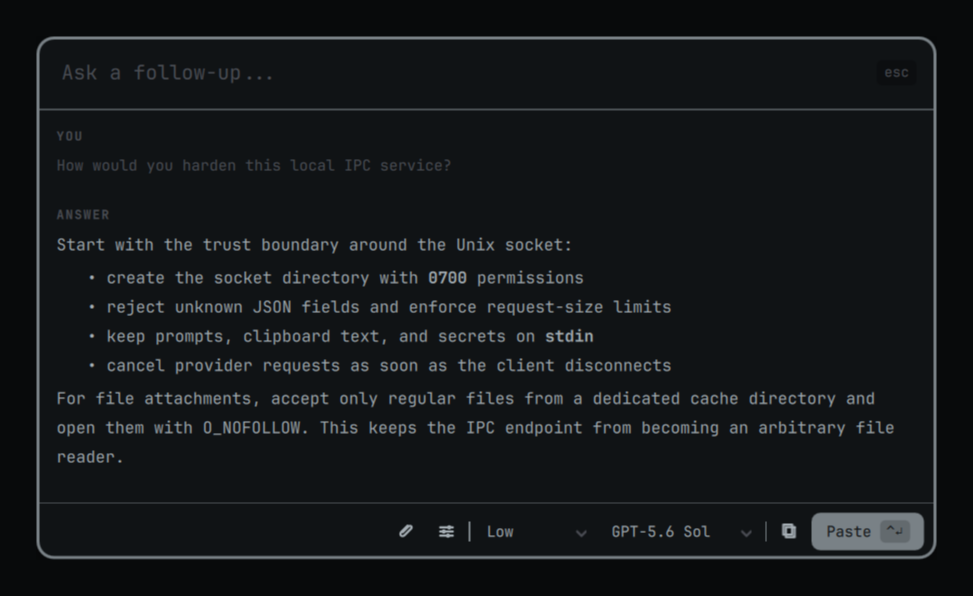
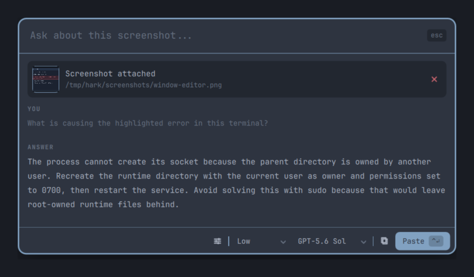
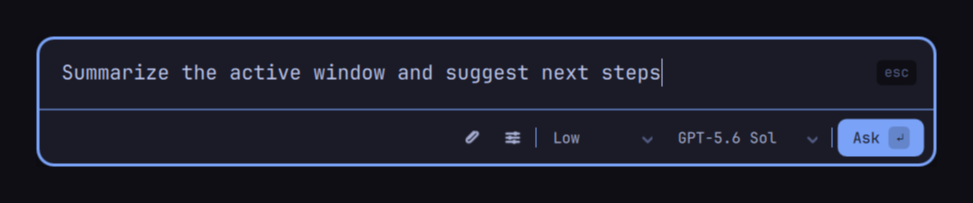
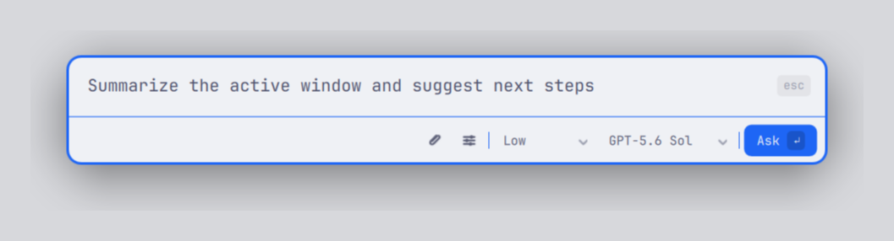
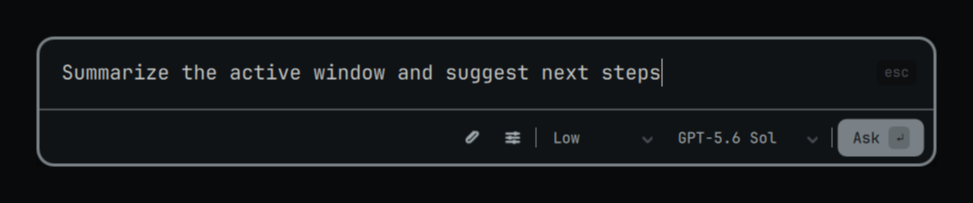
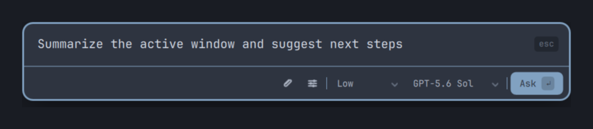

# Hark

Hark is a Wayland/Hyprland AI command palette built around a Quickshell UI and
a Go daemon.

<p align="center">
  
  <br><sub>Recent conversations</sub>
</p>

<p align="center">
  
  <br><sub>A conversation with an LLM response</sub>
</p>

<p align="center">
  
  <br><sub>A screenshot attached to the prompt</sub>
</p>

<table>
  <tr>
    <td width="50%" align="center">
      
      <br><sub>Tokyo Night</sub>
    </td>
    <td width="50%" align="center">
      
      <br><sub>Catppuccin Latte</sub>
    </td>
  </tr>
  <tr>
    <td width="50%" align="center">
      
      <br><sub>Solitude</sub>
    </td>
    <td width="50%" align="center">
      
      <br><sub>Nord</sub>
    </td>
  </tr>
</table>


- streaming through OpenAI, OpenRouter, or xAI, selectable per model
- automatic web search with clickable citations and source lists
- Markdown-formatted response rendering
- copy latest answer
- initial paste latest answer
- active Hyprland window capture for paste-back focus restore
- region screenshot attachments for image+text prompts
- conversation-level SQLite history for completed AI responses
- recent conversation restore and delete in the overlay
- optional history saving, configurable retention, and screenshot cleanup
- model selector with persisted selected model

Paste-back requires `wtype`:

```bash
omarchy pkg add wtype
```

Check local Wayland helper dependencies:

```bash
go run ./cmd/harkctl doctor
go run ./cmd/harkctl doctor --json
```

## Install on Omarchy

Hark is an Omarchy 4 plugin with `service`, `overlay`, and `bar-widget` entry
points. Enabling it adds a Hark button to the center section of the Omarchy
bar; click it to toggle the command palette. Install it from the generated
plugin repository, which carries the QML sources together with static `harkd`
and `harkctl` binaries, so installation needs no Go toolchain or first-run
download:

```bash
omarchy plugin add https://github.com/konradk/hark-plugin.git --enable
omarchy-shell shell summon hark
```

[`konradk/hark-plugin`](https://github.com/konradk/hark-plugin) is published
from this repository on every release and is not edited by hand. `omarchy
plugin add` clones its default branch and `omarchy plugin update`
fast-forwards it, so each commit there is one complete, self-consistent
release. Report issues and read the sources here instead.

Use the source checkout for local plugin development:

```bash
./scripts/build-plugin-runtime.sh
ln -sfn "$PWD" ~/.config/omarchy/plugins/hark
omarchy restart shell
omarchy plugin enable hark
```

The plugin starts its bundled daemon when necessary. If a compatible `harkd`
is already running through systemd, the plugin attaches to it and does not
stop it when the shell exits. Disable or remove the plugin with the normal
`omarchy plugin` commands; history and configuration remain in their XDG data
directories.

## Install on Arch + Hyprland

Build and install Hark for the current user:

```bash
./scripts/install.sh
```

The installer writes:

```text
~/.local/bin/harkd
~/.local/bin/harkctl
~/.config/quickshell/hark/shell.qml
~/.config/quickshell/hark/HarkShell.qml
~/.config/quickshell/hark/components/
~/.config/quickshell/hark/dev/
~/.config/quickshell/hark/js/
~/.config/systemd/user/harkd.service
~/.config/hark/hyprland.conf (managed Hark shortcut blocks)
~/.config/hypr/hyprland.conf (one Hark source line)
~/.config/hark/env
```

A source checkout requires Go 1.25.12 and runs the test suite before building.
A release archive contains static binaries and installs without Go. Files are
replaced atomically. The installer restarts an already-running daemon and
Quickshell instance; it does not enable a service that was previously
disabled. Set `HARK_SKIP_TESTS=1` or `HARK_NO_RESTART=1` only for controlled
automation.

Quickshell is required. Clipboard, screenshot, and paste-back features also
use `wl-clipboard`, `grim`, `slurp`, and `wtype`; `hyprctl` is supplied by
Hyprland. Run `harkctl doctor --json` to inspect the current system.

Store your OpenAI, OpenRouter, and/or xAI API key in the desktop Secret Service
keyring:

```bash
harkctl secret set openai
harkctl secret status openai

harkctl secret set openrouter
harkctl secret status openrouter

harkctl secret set xai
harkctl secret status xai
```

You can also read from stdin for scripts:

```bash
printf '%s' "$OPENAI_API_KEY" | harkctl secret set --stdin openai
printf '%s' "$OPENROUTER_API_KEY" | harkctl secret set --stdin openrouter
printf '%s' "$XAI_API_KEY" | harkctl secret set --stdin xai
```

The keyring always wins. Only when it holds no key — or when no Secret Service
daemon is running at all, which is common on a minimal Wayland session — does
Hark falls back to `OPENAI_API_KEY`, `OPENROUTER_API_KEY`, or `XAI_API_KEY`. Put them in
`~/.config/hark/env` (mode 0600, read by the systemd unit); exporting them from
your shell profile does not reach the daemon, because systemd starts it outside
your interactive shell. Keys sourced this way are shown as
`Set by environment variable` in settings and cannot be deleted from the UI.

The native xAI provider uses the Responses API with streaming, image input,
automatic web search, and clickable citations. The default catalog includes
`grok-4.6` and `grok-4.5`; Grok 4.6 additionally supports `xhigh` reasoning.

Then start the daemon:

```bash
systemctl --user enable --now harkd.service
harkctl status
```

The installer adds `Super+A` to open Hark and `Super+Alt+A` to capture the
focused window and attach it to Hark when both combinations are available.
Change or disable either shortcut from Hark Settings (`Ctrl+,`), or manage
them from the CLI:

```bash
harkctl shortcut get
harkctl shortcut set "SUPER + CTRL + A"
harkctl shortcut get --action screenshot
harkctl shortcut set --action screenshot "SUPER + ALT + A"
harkctl shortcut remove
```

These commands use standard Hyprland configuration by default. To manage an
Omarchy plugin shortcut explicitly, pass `--integration omarchy`; the generated
command summons the plugin through `omarchy-shell` rather than starting a
second Quickshell process.

## Development

Go 1.25.12 or newer is required to build the daemon and CLI. The version is
pinned in `mise.toml`; the Go toolchain directive provides the same version
when automatic toolchain downloads are enabled.

```bash
go mod tidy
go test ./...
go build ./cmd/harkd
go build ./cmd/harkctl
```

Build the static runtime used by the plugin and run its isolated lifecycle
test:

```bash
./scripts/build-plugin-runtime.sh
./scripts/test-plugin.sh
python3 scripts/test-plugin-manifest.py
omarchy plugin validate .
```

Both binaries expose embedded build metadata:

```bash
harkctl version
harkd -version
```

Start the daemon:

```bash
go run ./cmd/harkd
```

Check daemon status:

```bash
go run ./cmd/harkctl status
```

Ask a text-only question:

```bash
printf '%s' '{"prompt":"Say hello in one sentence"}' | go run ./cmd/harkctl ask --stdin
```

Continue with prior context from the CLI. Prompts and prior turns are read from
stdin so they never appear in `ps` output:

```bash
printf '%s' '{
  "prompt": "What is my codeword?",
  "messages": [
    {"role": "user", "content": "My codeword is amber."},
    {"role": "assistant", "content": "Noted."}
  ]
}' | go run ./cmd/harkctl ask --stdin --conversation-id example-chat
```

Reuse the same `--conversation-id` for later turns that should share one entry
in Recent.

Ask with an image attachment:

```bash
printf '%s' '{"prompt":"What is shown here?"}' | go run ./cmd/harkctl ask --stdin --image "${XDG_CACHE_HOME:-$HOME/.cache}/hark/screenshots/window-....png"
```

Use a PNG path returned by `screenshot-region --json` or
`screenshot-active-window --json`. Attachments are limited to four
Hark-managed screenshots, 20 MiB per file and 40 MiB in total. The daemon
validates file signatures and does not follow symlinks.

For UI integrations, stream newline-delimited JSON events:

```bash
printf '%s' '{"prompt":"Say hello in one sentence"}' | go run ./cmd/harkctl ask --stdin --json
```

Copy the latest daemon-tracked answer:

```bash
go run ./cmd/harkctl copy-latest --conversation-id example-chat
```

Copy explicit text through the daemon:

```bash
printf '%s' 'text to copy' | go run ./cmd/harkctl copy-text --stdin
```

Paste the latest daemon-tracked answer into the focused app:

```bash
go run ./cmd/harkctl paste-latest --conversation-id example-chat
printf '%s' 'explicit text' | go run ./cmd/harkctl paste-text --state-id example-ui --stdin
```

Inspect or remember the current Hyprland active window:

```bash
go run ./cmd/harkctl active-window
go run ./cmd/harkctl remember-active-window --state-id example-ui
```

Use the same state ID with `remember-active-window` and `paste-text` when
focus should be restored to the remembered window. Conversation-scoped
`copy-latest` and `paste-latest` require the ID used by `ask`.

Capture a screenshot region:

```bash
go run ./cmd/harkctl screenshot-region
go run ./cmd/harkctl screenshot-region --json
```

In the Quickshell overlay, use the `Screenshot` button or `Ctrl+Shift+C` while
the prompt is focused.

Inspect history:

```bash
go run ./cmd/harkctl history list --limit 20
go run ./cmd/harkctl history list --limit 20 --json
go run ./cmd/harkctl history get 1
go run ./cmd/harkctl history get --json 1
go run ./cmd/harkctl history delete 1
go run ./cmd/harkctl history clear --yes
```

The Quickshell overlay shows the ten most recent conversations. Click one to
restore its prompt and answer into the panel.

Persisted settings:

```bash
go run ./cmd/harkctl setting get selected_model
go run ./cmd/harkctl setting set selected_model gpt-5.6-sol
go run ./cmd/harkctl setting set show_recent_chats false
go run ./cmd/harkctl setting set save_history false
go run ./cmd/harkctl setting set history_retention_days 30
go run ./cmd/harkctl reasoning-modes --model gpt-5.6-sol --json
```

`show_recent_chats` only controls visibility. `save_history` independently
controls whether completed answers are persisted. A retention value of `0`
keeps history until it is deleted manually; positive values remove complete
inactive conversations after that many days. These privacy controls and a
confirmed “Clear all” action are also available in Hark Settings.

Global shortcut:

```bash
go run ./cmd/harkctl shortcut get
go run ./cmd/harkctl shortcut set --shell "$PWD/quickshell/shell.qml" "SUPER + A"
go run ./cmd/harkctl shortcut get --action screenshot
go run ./cmd/harkctl shortcut set --action screenshot --shell "$PWD/quickshell/shell.qml" "SUPER + ALT + A"
go run ./cmd/harkctl shortcut remove
```

The shortcut command updates only Hark's marked block in
`~/.config/hark/hyprland.conf`, refuses occupied bindings, and validates the
configuration after reloading Hyprland. The standalone installer adds the
corresponding `source` line to `~/.config/hypr/hyprland.conf`. For a plugin
shortcut, use `--integration omarchy`; that mode manages Hark's marked block in
`~/.config/hypr/bindings.lua` and invokes `omarchy-shell`.

Secrets:

```bash
go run ./cmd/harkctl secret status openai
go run ./cmd/harkctl secret set openai
go run ./cmd/harkctl secret delete openai

go run ./cmd/harkctl secret status openrouter
go run ./cmd/harkctl secret set openrouter
go run ./cmd/harkctl secret delete openrouter

go run ./cmd/harkctl secret status xai
go run ./cmd/harkctl secret set xai
go run ./cmd/harkctl secret delete xai
```

Secrets are stored through the Linux Secret Service keyring when available.
`OPENAI_API_KEY`, `OPENROUTER_API_KEY`, and `XAI_API_KEY` remain supported as environment
fallbacks.

History is stored at:

```text
~/.local/share/hark/history.db
```


Useful overlay keys:

```text
Enter           ask
Ctrl+Enter      paste latest answer
Ctrl+Shift+C    capture screenshot region
Ctrl+L          focus prompt and select text
Ctrl+J/K        move through recent history suggestions
Ctrl+M          open model picker
Ctrl+,          toggle settings
Ctrl+N          back to recent conversations (Ctrl+Backspace also works)
Ctrl+R          refresh recent history
Escape          close, or stop an active request
```


## Config

The default config path is:

```text
~/.config/hark/config.lua
```

Example:

```lua
return {
  ui = {
    theme = "system",
    colors = {
      panel = "#17191f",
      panel_border = "#3a3f4b",
      surface = "#101218",
      surface_elevated = "#10141c",
      surface_hover = "#202632",
      surface_active = "#263142",
      input = "#171d27",
      button = "#171d27",
      button_disabled = "#141821",
      button_hover = "#222a36",
      button_down = "#2a3240",
      primary = "#a7c7ff",
      primary_hover = "#9fd1ff",
      primary_down = "#7fb8e8",
      primary_text = "#071116",
      text = "#d7dce5",
      text_strong = "#f3f4f6",
      text_muted = "#7f8794",
      text_disabled = "#596170",
      assistant = "#8fbce8",
      error = "#d66a6a",
      error_text = "#ffb3b3",
      error_surface = "#24171b",
      error_border = "#6f3035",
      selection_text = "#111318",
    },
  },

  provider = {
    default_model = "gpt-5.6-sol",
    default_reasoning_effort = "low",
    models = {
      { id = "gpt-5.6-sol", label = "GPT-5.6 Sol", provider = "openai", reasoning_efforts = { "auto", "none", "low", "medium", "high", "xhigh", "max" } },
      { id = "gpt-5.6-terra", label = "GPT-5.6 Terra", provider = "openai", reasoning_efforts = { "auto", "none", "low", "medium", "high", "xhigh", "max" } },
      { id = "gpt-5.6-luna", label = "GPT-5.6 Luna", provider = "openai", reasoning_efforts = { "auto", "none", "low", "medium", "high", "xhigh", "max" } },
      { id = "gpt-5.5", label = "GPT-5.5", provider = "openai", reasoning_efforts = { "auto", "none", "low", "medium", "high", "xhigh" } },
      { id = "gpt-5.4", label = "GPT-5.4", provider = "openai", reasoning_efforts = { "auto", "none", "low", "medium", "high", "xhigh" } },
      { id = "gpt-5.4-mini", label = "GPT-5.4 Mini", provider = "openai", reasoning_efforts = { "auto", "none", "low", "medium", "high", "xhigh" } },
      { id = "gpt-5.4-nano", label = "GPT-5.4 Nano", provider = "openai", reasoning_efforts = { "auto", "none", "low", "medium", "high", "xhigh" } },
      { id = "anthropic/claude-opus-5", label = "Claude Opus 5 (OpenRouter)", provider = "openrouter", reasoning_efforts = { "auto", "none", "low", "medium", "high", "xhigh", "max" } },
      { id = "google/gemini-3.6-flash", label = "Gemini 3.6 Flash (OpenRouter)", provider = "openrouter", reasoning_efforts = { "auto", "minimal", "low", "medium", "high" } },
      { id = "x-ai/grok-4.6", label = "Grok 4.6 (OpenRouter)", provider = "openrouter", reasoning_efforts = { "auto", "low", "medium", "high", "xhigh" } },
      { id = "x-ai/grok-4.5", label = "Grok 4.5 (OpenRouter)", provider = "openrouter", reasoning_efforts = { "auto", "low", "medium", "high" } },
      { id = "grok-4.6", label = "Grok 4.6 (xAI)", provider = "xai", reasoning_efforts = { "auto", "low", "medium", "high", "xhigh" } },
      { id = "grok-4.5", label = "Grok 4.5 (xAI)", provider = "xai", reasoning_efforts = { "auto", "low", "medium", "high" } },
    },
  },

  providers = {
    { id = "local", label = "Local vLLM", base_url = "http://localhost:8000/v1" },
  },

  paste = {
    restore_focus = true,
    delay_ms = 80,
    shortcut = "ctrl_shift_v",
  },
}
```

Each model owns its `reasoning_efforts` capability list. `auto` is Hark's
provider-default option; the remaining values are sent to the provider API.
When adding a custom model, set this list to the efforts that model accepts.

### Custom OpenAI-compatible providers

The `providers` table defines additional providers that speak the standard
OpenAI Chat Completions API at a configurable base URL. Each entry takes an
`id` (referenced from `provider.models`), an optional `label` (shown in the
model picker), and a `base_url` (an absolute `http` or `https` URL). Model
entries that name a custom provider id are routed through that base URL:

```lua
return {
  providers = {
    { id = "local", label = "Local vLLM", base_url = "http://localhost:8000/v1" },
    { id = "corp-gw", base_url = "https://llm.example.com/v1" },
  },
  provider = {
    default_model = "llama-3",
    models = {
      { id = "llama-3", label = "Llama 3", provider = "local", reasoning_efforts = { "auto", "low", "medium", "high" } },
    },
  },
}
```

The API key for a custom provider is resolved like the built-in ones, from the
desktop Secret Service keyring under the provider id or, failing that, an
`<ID>_API_KEY` environment variable (for example `LOCAL_API_KEY` for `local`,
`CORP_GW_API_KEY` for `corp-gw`):

```bash
harkctl secret set local
printf '%s' "$LOCAL_API_KEY" | harkctl secret set --stdin local
```

Custom providers use the Chat Completions endpoint, so they work with any
OpenAI-compatible server (Ollama, LM Studio, vLLM, local gateways, and most
hosted proxies). They do not request Hark's web-search plugin, so a provider's
own web-search behavior applies. Provider ids must be unique and must not
reuse `openai`, `openrouter`, or `xai`.

You can also manage providers from Hark Settings (`Ctrl+,`) without touching
the config file. The **Providers** section lists every panel-managed provider
and lets you:

- **Add** or **edit** a provider (name, base URL, and API key).
- Type the **model ids** right in the same form; each one becomes a tag you can
  remove, and a provider can hold **multiple models**. Model names are their
  endpoint id, so there is nothing extra to name.

Providers created this way are stored by the daemon and merged with the ones
in `config.lua`; config-file entries take precedence on ID collisions. The
same operations are available on the CLI:

```bash
harkctl provider list --json
harkctl provider save --json --id local --label "Local vLLM" --base-url http://localhost:8000/v1 --model llama-3.1-8b --model llama-3.2
harkctl provider remove --json --id local
```

## Releases

See [CHANGELOG.md](CHANGELOG.md) for user-visible changes in each release.

Releases are built from annotated or lightweight SemVer tags:

```bash
git tag v0.1.0
git push origin v0.1.0
```

## License

[MIT](LICENSE).
